# Comelit Product Catalog

## 📌 Project Overview
This application is a robust product catalog browser developed to interface with the Comelit REST API. The core focus of this implementation is **resilience**: the client is engineered to maintain a high-quality user experience even when the backend is unstable, slow, or returning incomplete data.

---

## 📸 Gallery

<div align="center">

| | | | | |
| :---: | :---: | :---: | :---: | :---: |
| 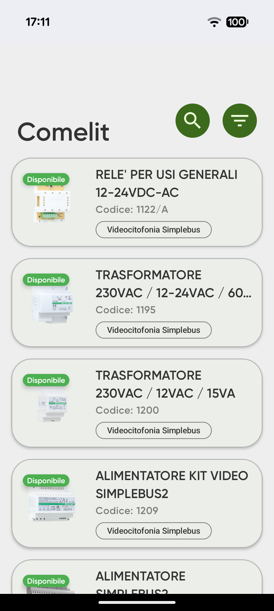 | 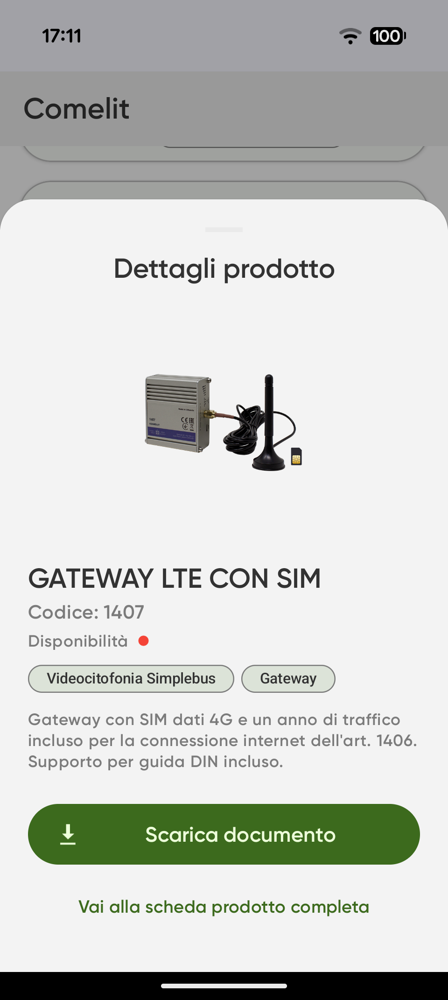 | 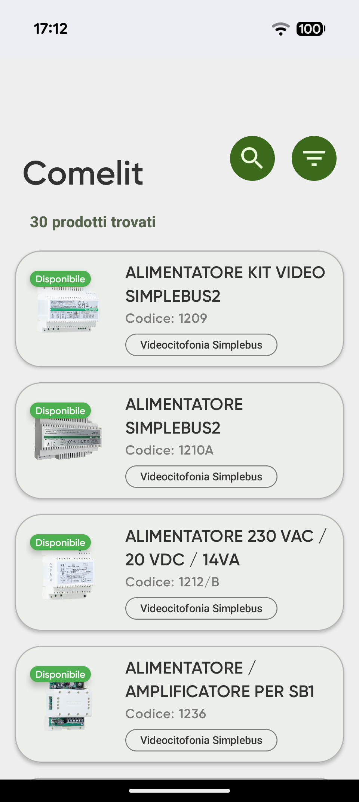 | 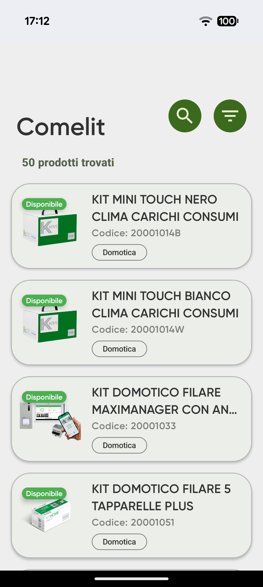 | 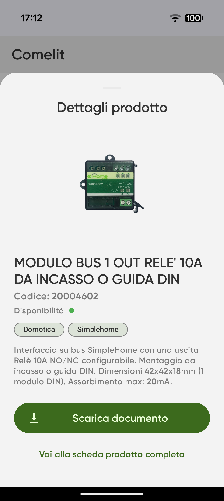 |
| 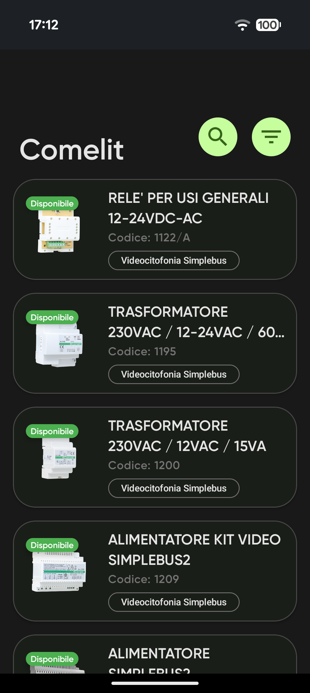 | 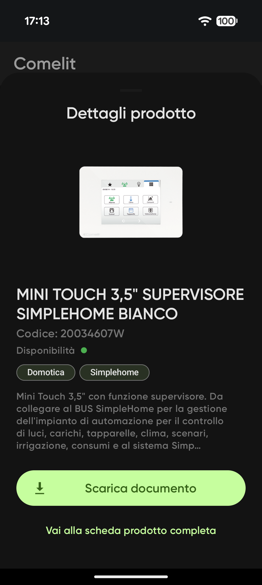 | 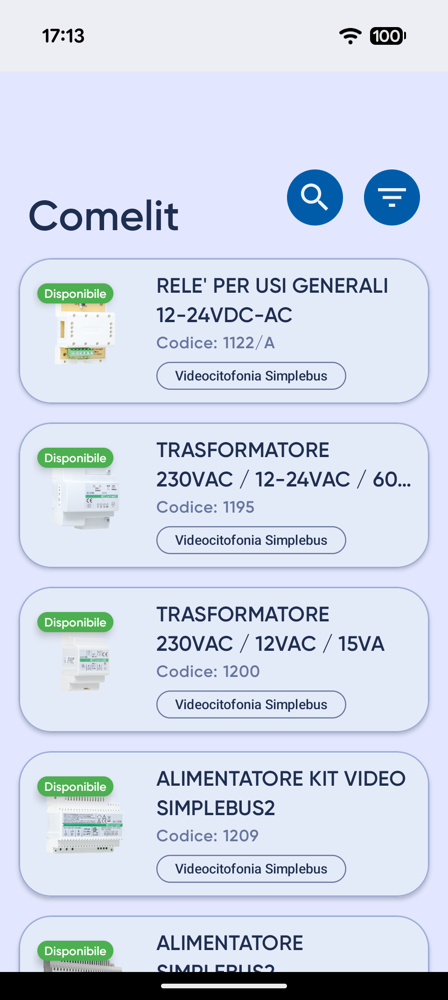 | 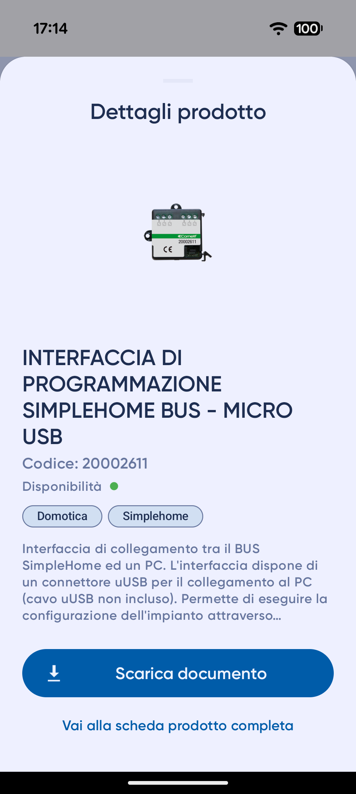 | 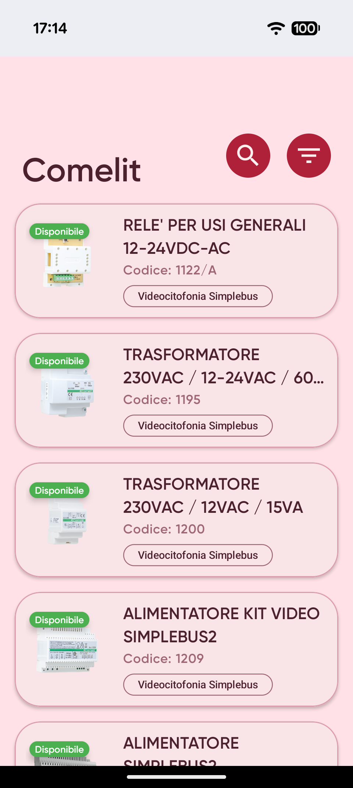 |
| 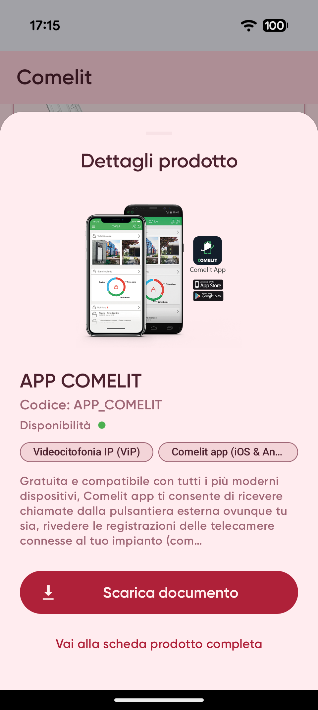 | 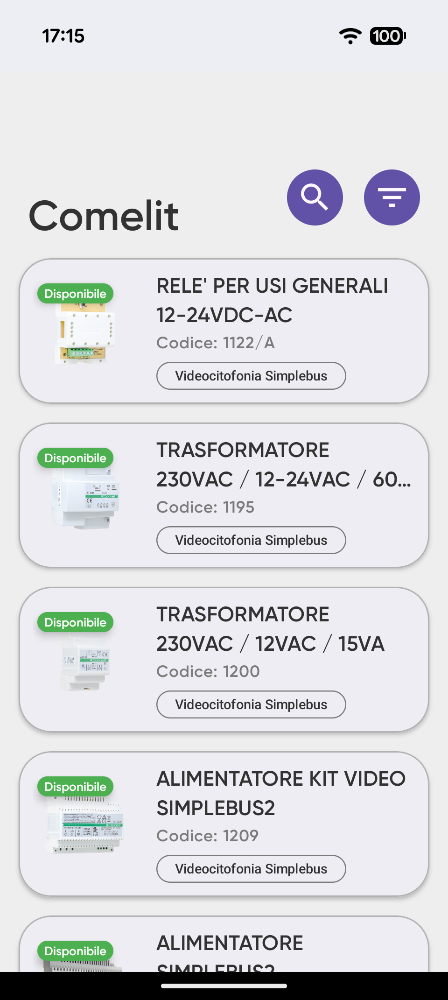 | 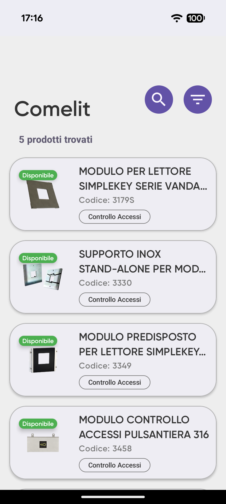 | 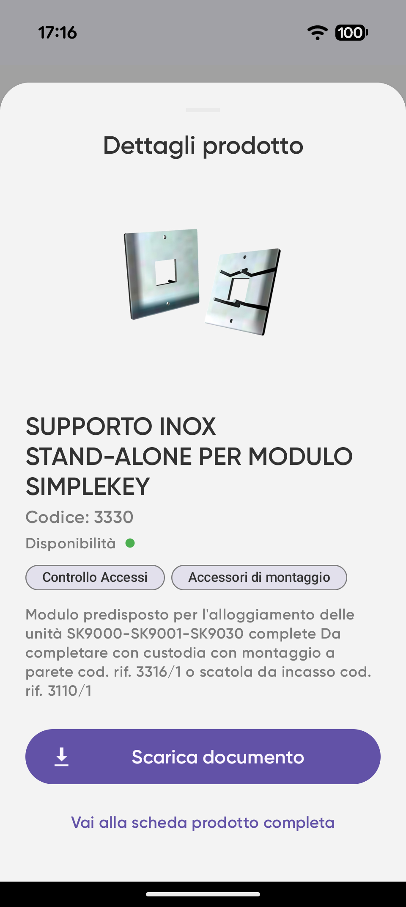 | |

</div>

---

## 🛠️ Architecture & Technical Stack
The app follows a **Resilient Data-Driven** architecture, prioritizing network stability and data safety.

*   **Networking:** Retrofit 2 + OkHttp 3.
*   **Image Loading:** Glide (with `DiskCacheStrategy.ALL` for offline-ready thumbnails).
*   **Concurrency:** Asynchronous Retrofit Callbacks.
*   **UI Pattern:** View-based with a `Resource<T>` state wrapper (Loading, Success, Error).
*   **UI Components:** Material Design 3 (BottomSheet, Chips, SwipeRefreshLayout).

---

## 🔍 Requirements Implementation Checklist

This section tracks the implementation of the features requested.

### ✅ Minimum Requirements (Mandatory)
| Feature | Status | Technical Note |
| :--- | :---: | :--- |
| **Paginated Product List** | 🟢 Implemented | Managed via `apiService.getProducts` with page/size params. |
| **Infinite Scrolling** | 🟢 Implemented | Custom `OnScrollListener` logic in `MainActivity`. |
| **Text Search** | 🟢 Implemented | Dynamic query filtering via `currentQuery` state. |
| **Category Filtering** | 🟢 Implemented | Category-specific API calls supported. |
| **Product Detail** | 🟢 Implemented | Handled via `BottomSheetDialog` with secondary API call. |
| **Loading, Empty, Error States** | 🟢 Implemented | Managed through `Resource<T>` state wrapper and Error Layouts. |
| **Retry after Error** | 🟢 Implemented | Dedicated "Retry" button and **Swipe-to-Refresh** gesture. |

### 🟡 Recommended Requirements
| Feature | Status | Technical Note |
| :--- | :---: | :--- |
| **Combined Search & Filters** | 🟢 Implemented | The API call concurrently handles both `query` and `category`. |
| **Preserve UI State** | 🟠 Partial | Basic state kept in Activity; full persistence via ViewModel is in the Roadmap. |
| **Avoid Duplicates** | 🟢 Implemented | List reset logic on new queries and strict pagination offset handling. |
| **Clear Error vs No Results** | 🟢 Implemented | UI distinguishes between empty lists (Success) and API failures (Error). |
| **Image Placeholders/Fallbacks** | 🟢 Implemented | Glide `placeholder()` and `error()` implementation. |

### 🔵 Optional Features
| Feature | Status | Technical Note |
| :--- | :---: | :--- |
| **Local Cache** | 🟠 Partial | Managed via Glide's disk cache for images (no SQL database). |
| **Offline Support (Visited)** | 🟠 Partial | Only previously loaded images are available during outages via disk cache. |
| **Manual Content Update** | 🟢 Implemented | **Swipe-to-Refresh** integrated in the main product list. |
| **PDF/External Link Support** | 🟢 Implemented | Intent-based opening for Datasheets and Source URLs. |
| **Favorites / Recents** | 🔴 Not Implemented | Excluded to prioritize core network resilience within the timebox. |

---

## ⚙️ Key Architectural Decisions & Trade-offs

*   **Data Sanitization at POJO Level:** Instead of handling null checks in the UI layer, I centralized the logic in the Model getters (`Product.java`). This ensures that the UI always receives a valid (though potentially empty) object, eliminating `NullPointerExceptions`.
*   **Dual-Stage Loading UX:** To mitigate API slowness, the `BottomSheet` immediately populates using data already available in the list while the "heavy" details (PDFs/Full descriptions) load in the background.
*   **Resilience over Complexity:** Given the 4-6 hour timebox, I prioritized **Network Resilience** (handling the 2-minute blackout and slow API) over a local database (Room). Multimedia persistence is handled via Glide's disk cache to allow viewing of visited content during outages.

---

## ⚠️ Reliability Strategy
The API was designed to be "intentionally imperfect." Here is the defense strategy:
*   **Outage Window (2 min every 30 min):** Handled by combining `OkHttp` retries, extended timeouts (20s), and a user-friendly Error State with manual refresh options.
*   **Dirty Data:** Models validate URLs before passing them to Glide or Intent, preventing the app from attempting to open broken links.
*   **Inconsistent Images:** Used `centerCrop` and `placeholder()` to ensure a consistent grid layout even when source images are missing or vary in size.

---

## 🔐 Environment & Security Configuration
To ensure project portability and security, I implemented a **Non-Hardcoded Configuration** strategy:

*   **Credential Isolation:** Sensitive data (API Base URL, Username, Password) are stored in `local.properties` and are excluded from version control.
*   **Build Injection:** The app leverages Gradle's `buildFeatures.buildConfig` to inject these values at compile time.

---

## 🚀 Future Improvements (Next Steps)

With more time, the following enhancements would be prioritized to transition the project from a professional prototype to a production-ready application:

1.  **Architecture Refactoring (MVVM):** 
    *   Migrate business logic and pagination state from the `MainActivity` to a `ViewModel`. 
    *   Leverage `StateFlow` or `LiveData` to observe UI states, ensuring full state persistence during configuration changes (rotations) and a cleaner separation of concerns.

2.  **Advanced API Testing & Resilience:**
    *   **Chaos Engineering for Mobile:** Implement a more rigorous testing suite to simulate random 5xx errors, high latency, and malformed JSON responses. This would ensure the app remains functional even under extreme "unreliable" conditions beyond the 2-minute blackout window.
    *   **Unit Testing:** Add JUnit tests for the POJO fallback logic and API response mapping to ensure data integrity.

3.  **Gamified Error Recovery (UX/Easter Eggs):**
    *   **Improved Fail-State UX:** To mitigate user frustration during API outages, I would integrate a gamified experience or "Easter Egg" (similar to Chrome's Dino Runner) within the error layout. 
    *   This provides a psychological "buffer" during technical downtime, encouraging the user to stay within the app while the connection is being automatically retried in the background.
    *   **Observability:** Integrate monitoring tools (e.g., Firebase Crashlytics) to track real-time API failure rates and response latencies, enabling proactive maintenance of the unstable backend.

4. **UI Hardcoding Cleanup & Localization:**
    * **Resource Externalization:** Currently, some strings, dimensions, and colors are defined directly within the layout files and classes to prioritize rapid prototyping of the core logic. The immediate next step is a full resource externalization.
    * **Internationalization (i18n):** This separation will allow the app to support multiple languages (e.g., Italian, English, French) which is essential for Comelit’s global market.
    * **Theming & Dark Mode:** Centralizing colors into the Material Design theme engine to natively support Dark Mode and ensure brand consistency across all screens without modifying Java/XML logic.

---

## 🛠️ Build & Run Instructions
1.  Clone the repository.
2.  Open the project in **Android Studio**.
3.  **Crucial Step:** Create or update your `local.properties` file in the root folder with:
    ```properties
    API_BASE_URL="http://95.179.148.110:8090/"
    API_USERNAME="your_username"
    API_PASSWORD="your_password"
    ```
4.  Perform a **Gradle Sync**.
5.  Build and Run.
